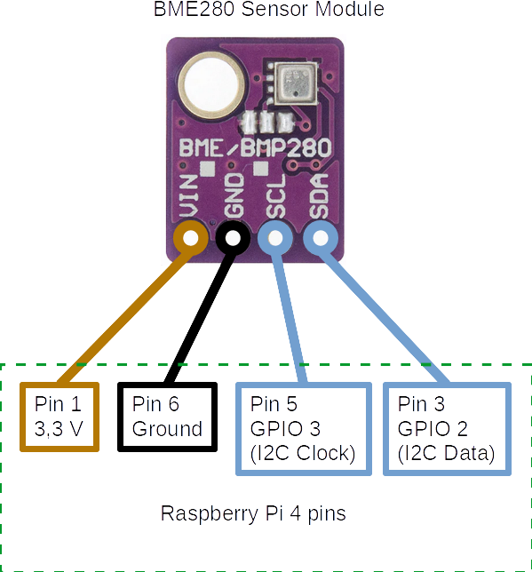

# BME280 LabVIEW code for Raspberry Pi

This project contains a LabVIEW reading procedure of the Bosch BME280 sensor through the Raspberry Pi.<br>
The Bosch BME280 ([pdf data sheet](Documents/bst-bme280-ds002.pdf)) is a digital temperature, pressure and humidity sensor. This LabVIEW project implements a code, for Raspberry Pi 4, that periodically read the BME280 sensor and display the calibrated measures. The sensor reading is performed via I2C bus interface.

## Wiring

The BME280 sensor requires 4 wires. Two of the wires are used for the power supply, VIN (3.3 V) and GND (Ground), and the remaining two are used for the I2C bus, SDA (I2C Data) and SCL (I2C Clock).<br>
The following table shows the pins correspondence between the BME280 sensor and the 40-pins connector of the Raspberry Pi 4.

| BME280 | Raspberry Pi |
| ----- | ----- |
| VIN | Pin 1 - 3.3 V Power |
| GND | Pin 6 - Ground |
| SCL | Pin 5 - GPIO 3 (I2C Clock) |
| SDA | Pin 3 - GPIO 2 (I2C Data) |

The Raspberry Pi pinout description can be found at https://pinout.xyz/.

<p align="center">BME280 - Raspberry Pi pinout</p>
<p align="center"></img></p>

## Raspberry Pi setup

### How to enable I2C bus on RPi device
Use the raspi-config utility to activate i2c-bus on the OS level.<br>
Use the `sudo raspi-config` command to open the utility, and navigate to the "Interfaceing Options" menu to enable automatic loading of I2C kernel module. Probably you will need to reboot to load the I2C kernel module.<br>
Finally you should have device like /dev/i2c-1 present in the system:
```
$ ls -l /dev/i2c-1
crw-rw---- 1 root i2c 89, 1 Aug 26 17:17 /dev/i2c-1
```
### How to find I2C bus allocation and device address
Use the `i2cdetect -y <i2cbus>` command , from the i2cdetect utility, to discover the address occupied by peripheral device. \<i2cbus\> indicates the number or name of the I2C bus to be scanned, and may vary from 0 to 5 or more.<br>
To install the utility you can run the `apt install i2c-tools` on debian-kind system.

The `i2cdetect -l` outputs the list of installed busses, a sample output is:
```
i2c-1   i2c             bcm2835 (i2c@7e804000)                  I2C adapter
```
On Raspberry Pi 4 the `i2c-1` bus is wired to GPIO 2 and GPIO 3, and the corresponding bus number is `1`

If only the BME280 sensor is connected to the `i2c-1` bus, the `i2cdetect -y 1` sample output is:
```
    0  1  2  3  4  5  6  7  8  9  a  b  c  d  e  f
00:          -- -- -- -- -- -- -- -- -- -- -- -- --
10: -- -- -- -- -- -- -- -- -- -- -- -- -- -- -- --
20: -- -- -- -- -- -- -- -- -- -- -- -- -- -- -- --
30: -- -- -- -- -- -- -- -- -- -- -- -- -- -- -- --
40: -- -- -- -- -- -- -- -- -- -- -- -- -- -- -- --
50: -- -- -- -- -- -- -- -- -- -- -- -- -- -- -- --
60: -- -- -- -- -- -- -- -- -- -- -- -- -- -- -- --
70: -- -- -- -- -- -- 76 --    
```
The BME280 device 7-bit address is `0x76`. The I2C address is used by the code to communicate with the sensor. Many sensors have I2C address hard-coded, and, as reported in the data sheet, this is the case of the BME280 sensor.

## LabVIEW project
To connect the LabVIEW project to the Raspberry Pi, change the IP Address of the "Raspberry Pi" target, in the project, according to your need.

The VI routine named `RPi_I2C_BME280_read_example.vi` contains an example of the reading procedure of the BME280 sensor through the I2C bus.<br>
The procedure consists in the following steps:

0. Opens the I2C channel. The Raspberry Pi I2C channel is set to `1` and the 7-bit device address is set to `0x76`
1. Reads the BME280 Calibration Coefficients. First reads the Calibration Registers, than converts the Registers to Raw Calibration Coefficients.
2. Initializes the BME280 device for operation in 'Normal mode'. The normal mode is a perpetual cycling of measurements and inactive periods.
3. Cyclically reads the data registers from the BME280 device and converts them in calibrated Pressure, Temperature and Humidity measures.
4. Close the I2C channel.

<p align="center">The RPi_I2C_BME280_read_example.vi block diagram</p>
<p align="center"></img></p>

## Requirements
### Hardware
- Raspberry Pi 4
- Bosch BME280 (temperature, pressure and humidity sensor)

### Development environment
- Nationa Intruments LabVIEW 2020 SP1
- NI LabVIEW LINX Toolkit 1.0.0.9

## License
This project is licensed under MIT. <br>
Please see the [LICENSE](LICENSE) file for details.
